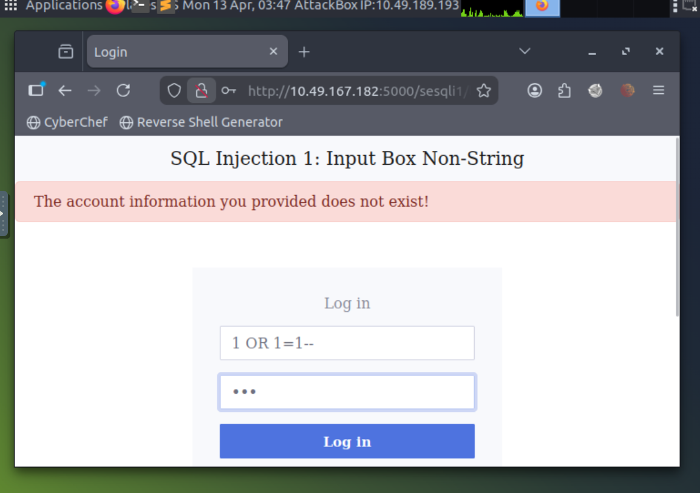
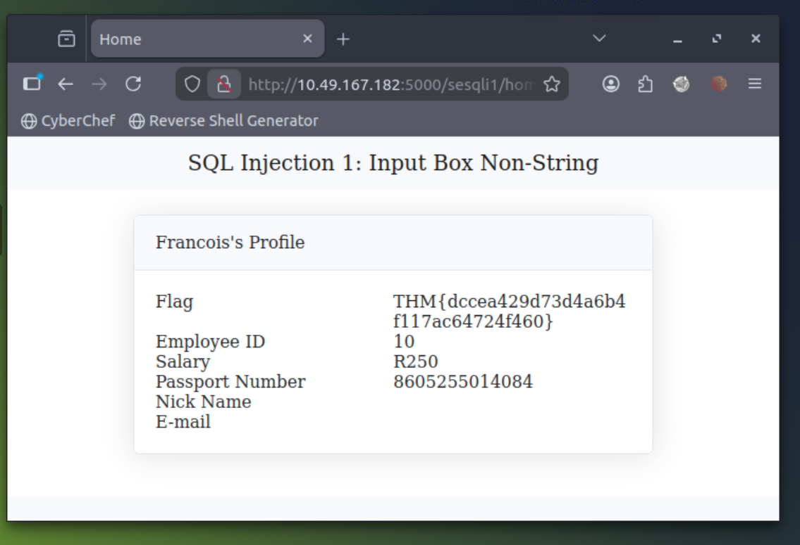

\# SQL Injection - Login Bypass (Lab Practice)

\## 🎯 Tujuan

Memahami bagaimana login bisa dibypass menggunakan SQL Injection.

---

\## 🧠 Konsep Dasar

Query login normal:

SELECT \* FROM users WHERE username = 'input' AND password = 'input';

Jika kita input:

' OR 1=1--

Query menjadi:

SELECT \* FROM users WHERE username = '' OR 1=1--' AND password = '';

👉 1=1 selalu TRUE → login berhasil

---

\## 🧪 Percobaan

\### Payload gagal:

\- 1 OR 1=1 ❌ (tidak valid karena query structure)

\### Payload berhasil:

\- ' OR 1=1-- ✅

---

\## 📸 Bukti

(lihat folder /screenshots)

---

\## 🧠 Insight

\- Website tidak menggunakan sanitasi input

\- SQL query langsung menerima input user

\- Comment (--) digunakan untuk memotong query

---

\## ⚠️ Risiko di dunia nyata

\- Login tanpa password

\- Akses data user lain

\- Potensi jadi admin

---

\## 🛡️ Cara mencegah

\- Prepared Statements

\- Input validation

\- ORM

---

\## 📚 Tools

\- Browser (manual testing)

\- TryHackMe Lab

---

---

## 📸 Bukti Percobaan

### 1. Login Bypass Berhasil

### 2. Login Sukses

> Note:
> Pesan error di gambar berasal dari percobaan sebelumnya (UI tidak refresh).
> Login tetap berhasil.